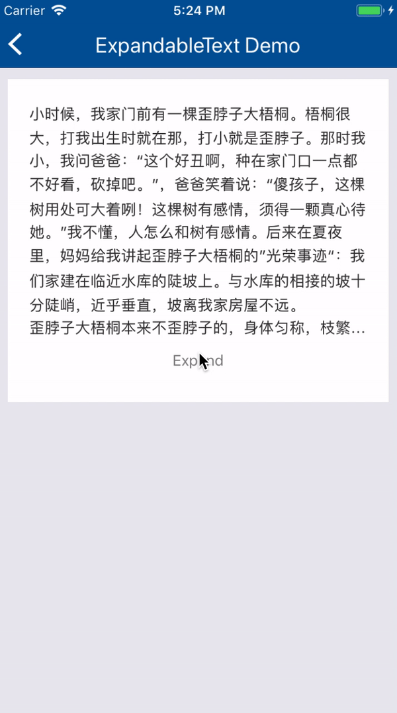
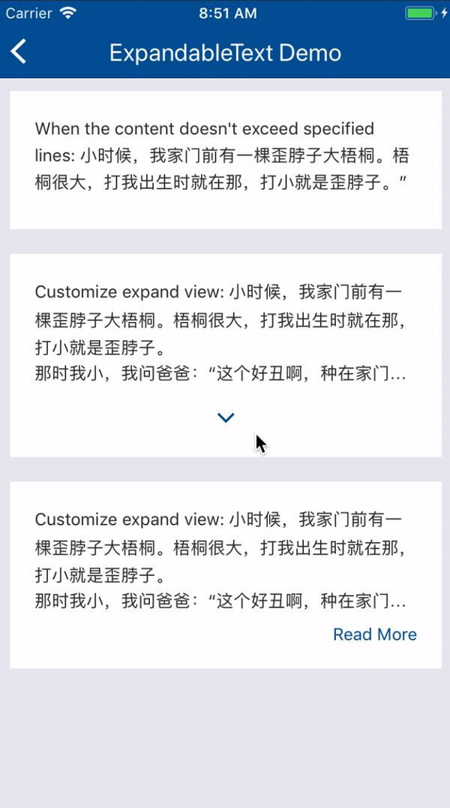

# RN-ExpandableText

[](https://npmjs.com/package/rn-expandable-text)
[](https://opensource.org/licenses/Apache-2.0)

## Introduction

RN-ExpandableText is an component of React Native, all the usages of ExpandableText is the same as the native `Text` component, but it will collapse text when its content exceeds specified number of lines.

## Installation
 ```
 npm install rn-expandable-text --save
 ```

## ExpandableText Usage

```javascript
    import ExpandableText from 'rn-expandable-text'
    
    <ExpandableText
      numberOfLines={10}
      style={styles.expandableText}
      unexpandView={() => null}
      expandView={() =>
        (<View style={styles.arrow} />)
      }
    >
      {content}
    </ExpandableText>
```
## Properties

| Prop                  | Description                              | Default        |
| --------------------- | ---------------------- | -------------- |
|numberOfLines|The max number of lines the content will be, the content exceed this value, the expandview will show.|5|
|expandView| A callback function to return expand-view, you can customize the expand-view. when it's null, expand-view will disappear
|unexpandView| A callback function to return unexpand-view. Usage the same as expandView|
|onExpand| A callback when the content expands| - |
|onCollapse| A callback when the content collapses| - |

## Demos
|Default View|customize the expand-view|
|-------|----------|
||

## Follow Me

<div style="text-align:center">
<h4>Follow me on Wechat<h4>
 
</div>